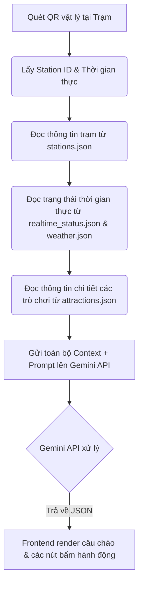

# Hướng Dẫn Tích Hợp Gemini API & Mock Data (WonderPath AI)

Tài liệu này hướng dẫn cách nhóm C2 sử dụng bộ Mock Data đã tạo để tích hợp vào **Gemini API** trên prototype Web App hoặc Zalo Mini App.

---

## 1. Luồng hoạt động (Data Flow)



---

## 2. Thiết kế Prompt cho Gemini API (System Prompt)

Để Gemini trả về dữ liệu đúng cấu trúc JSON mà không có văn bản dư thừa, bạn cần truyền một **System Prompt** chặt chẽ và yêu cầu định dạng đầu ra (JSON Mode).

### System Prompt Mẫu:
```text
Bạn là WonderPath AI - Trợ lý dẫn đường ngữ cảnh thông minh tại công viên phức hợp giải trí lớn. 
Nhiệm vụ của bạn là phân tích ngữ cảnh hiện tại của du khách và đề xuất lịch trình vi mô (1-2 tiếng tiếp theo) tối ưu, an toàn và cá nhân hóa nhất.

Dữ liệu hệ thống cung cấp cho bạn gồm:
1. Danh sách trò chơi tĩnh (attractions): {{attractions}}
2. Bản đồ các trạm QR (stations): {{stations}}
3. Trạng thái vận hành & hàng đợi thời gian thực (realtime_status): {{realtime_status}}
4. Thời tiết hiện tại (weather): {{weather}}

Ngữ cảnh hiện tại của du khách quét QR:
- Mã trạm quét QR hiện tại: {{current_station_id}}
- Thời gian quét: {{current_time}}
- Thông tin nhóm du khách (user_profile): {{user_profile}} (nếu null tức là chưa có thông tin phân loại nhóm du khách).

QUY TẮC XỬ LÝ LỊCH TRÌNH VÀ RỦI RO (FAILURE MODES):
1. [QUY TẮC THỜI TIẾT]: Nếu weather.warning_level là "red" (dông bão cực đoan), lập tức ẨN mọi gợi ý ngoài trời (outdoor). Đưa ra cảnh báo đỏ và gợi ý 1-2 điểm trú ẩn hoặc vui chơi trong nhà (indoor) an toàn và gần trạm quét nhất.
2. [QUY TẮC BẢO TRÌ/QUÁ TẢI]: Đối chiếu trạng thái các trò chơi lân cận trong `realtime_status`. Nếu trò chơi định gợi ý đang có trạng thái "maintenance" hoặc thời gian xếp hàng > 45 phút, KHÔNG gợi ý trò đó nữa. Hãy chủ động gợi ý trò chơi thay thế gần nhất có hàng đợi ngắn (< 20 phút) hoặc khu ẩm thực/nghỉ ngơi lân cận.
3. [QUY TẮC PROFILE]:
   - Nếu user_profile là null: Đưa ra câu chào ngắn gọn và hỏi lại thông tin nhóm du khách để phân loại thông qua các nút bấm. Không tự tiện gợi ý lịch trình chi tiết khi chưa biết đối tượng.
   - Nếu user_profile có trẻ nhỏ/người già: Lọc bỏ toàn bộ trò chơi có thrill_level là "high" hoặc vi phạm giới hạn chiều cao (min_height_cm). Gợi ý các trò nhẹ nhàng (thrill_level: "low"), có tính chất gia đình, hoặc khu vui chơi trong nhà (KidZone).
   - Nếu user_profile là nhóm bạn trẻ (thrill_seekers): Ưu tiên gợi ý các trò cảm giác mạnh (thrill_level: "high" hoặc "medium"), các show diễn hấp dẫn và đồ ăn nhanh.
4. [QUY TẮC LỊCH TRÌNH VI MÔ]: Gợi ý tối đa 2 hoạt động/trò chơi tiếp theo trong vòng 1-2 tiếng tới, nêu rõ lý do lựa chọn ngắn gọn (ví dụ: khoảng cách gần bao nhiêu mét, thời gian chờ bao nhiêu phút, hoặc sắp đến giờ show diễn).

YÊU CẦU ĐẦU RA (OUTPUT FORMAT):
Bạn PHẢI trả về dữ liệu duy nhất dưới dạng JSON có cấu trúc sau (không bao gồm markdown ```json ... ``` hoặc bất kỳ ký tự nào khác ngoài JSON):
{
  "message": "Câu chào mừng và đề xuất lịch trình siêu ngắn gọn (tối đa 3 câu văn), viết bằng tiếng Việt tự nhiên, ấm áp.",
  "ui_buttons": [
    {
      "label": "Nhãn của nút bấm hiển thị trên UI (ngắn gọn, ví dụ: 'Chơi Lâu Đài Huyền Bí (chờ 10p)' hoặc '🚨 Chỉ đường trú mưa')",
      "action": "Loại hành động: 'navigate' | 'update_profile' | 'suggest_dining' | 'request_alternative'",
      "target_id": "Mã ID của trò chơi (attraction_id) nếu action là 'navigate' để vẽ bản đồ đường đi, hoặc null",
      "data": { ... dữ liệu đính kèm nếu cần update_profile ... }
    }
  ]
}
```

---

## 3. Định dạng Payload Đầu Vào & Đầu Ra Mẫu

### 3.1. Kịch bản 1: Khách quét QR ở Cổng khu Cổ Tích, thời tiết nắng ấm (Happy Path)

**Input Context truyền vào Prompt:**
```json
{
  "current_station_id": "qr_station_01",
  "current_time": "10:00",
  "user_profile": {
    "group_type": "family_with_kids",
    "has_elderly": false,
    "min_height_cm": 100
  }
}
```

**Expected JSON Response từ Gemini:**
```json
{
  "message": "Chào mừng gia đình mình đến với Khu Cổ Tích! Thời tiết hiện tại nắng ấm (31°C) rất đẹp. WonderPath gợi ý lịch trình 1-2 tiếng tới cho gia đình:\n1. Xem 'Show Rồng Lửa' sắp bắt đầu lúc 10:15 (cách 350m, đi bộ 5 phút).\n2. Chơi 'Lâu Đài Huyền Bí' (cách 50m, chờ xếp hàng 15 phút, trò chơi trong nhà mát mẻ phù hợp cho bé).\nBạn muốn đi đâu trước ạ?",
  "ui_buttons": [
    {
      "label": "Xem Show Rồng Lửa (10:15)",
      "action": "navigate",
      "target_id": "att_show_fire_dragon"
    },
    {
      "label": "Chơi Lâu Đài Huyền Bí",
      "action": "navigate",
      "target_id": "att_magic_castle"
    },
    {
      "label": "Ăn trưa tại Lâu Đài Cổ Tích",
      "action": "navigate",
      "target_id": "att_castle_restaurant"
    }
  ]
}
```

### 3.2. Kịch bản 4: Trời đổ dông bão bất ngờ (Emergency Path)

**Input Context truyền vào Prompt:**
```json
{
  "current_station_id": "qr_station_03",
  "current_time": "15:00",
  "user_profile": {
    "group_type": "family_with_kids",
    "has_elderly": true,
    "min_height_cm": 90
  }
}
```
*(Lúc này phía server của bạn đã đọc thấy trạng thái thời tiết là `stormy` cảnh báo đỏ nên truyền vào biến `{{weather}}` thông tin thời tiết dông sét).*

**Expected JSON Response từ Gemini:**
```json
{
  "message": "⚠️ CẢNH BÁO: Trời đang có dông sét nguy hiểm ngoài trời! Để đảm bảo an toàn cho cả nhà, WonderPath khuyên bạn di chuyển NGAY vào các khu vực trú ẩn trong nhà gần nhất.",
  "ui_buttons": [
    {
      "label": "🚨 Chỉ đường trú mưa KidZone (cách 250m)",
      "action": "navigate",
      "target_id": "att_indoor_playground"
    },
    {
      "label": "Chỉ đường tới Chòi Nghỉ Ven Hồ (cách 30m)",
      "action": "navigate",
      "target_id": "att_lakeside_gazebo"
    }
  ]
}
```

---

## 4. Gợi ý triển khai code nhanh trên Node.js / Python (Day 06)

Khi gọi Gemini API, hãy sử dụng tính năng **Structured Outputs** (hoặc `responseSchema`) để ép kiểu JSON trả về 100% chính xác.

### Ví dụ cấu hình Schema bằng SDK Google Gen AI (Javascript):

```javascript
import { GoogleGenAI, Type } from "@google/genai";

const ai = new GoogleGenAI({ apiKey: process.env.GEMINI_API_KEY });

const responseSchema = {
  type: Type.OBJECT,
  properties: {
    message: {
      type: Type.STRING,
      description: "Lời chào và lịch trình gợi ý siêu ngắn bằng tiếng Việt.",
    },
    ui_buttons: {
      type: Type.ARRAY,
      items: {
        type: Type.OBJECT,
        properties: {
          label: { type: Type.STRING, description: "Nhãn hiển thị trên nút bấm" },
          action: { type: Type.STRING, description: "Hành động: navigate, update_profile, suggest_dining, request_alternative" },
          target_id: { type: Type.STRING, description: "Mã attraction_id tương ứng hoặc null" },
          data: { type: Type.OBJECT, description: "Dữ liệu đính kèm tùy chọn" }
        },
        required: ["label", "action"],
      },
    },
  },
  required: ["message", "ui_buttons"],
};

const response = await ai.models.generateContent({
  model: 'gemini-2.5-flash', // Hoặc gemini-1.5-flash
  contents: promptText,
  config: {
    responseMimeType: "application/json",
    responseSchema: responseSchema,
  }
});

const result = JSON.parse(response.text);
console.log(result);
```
