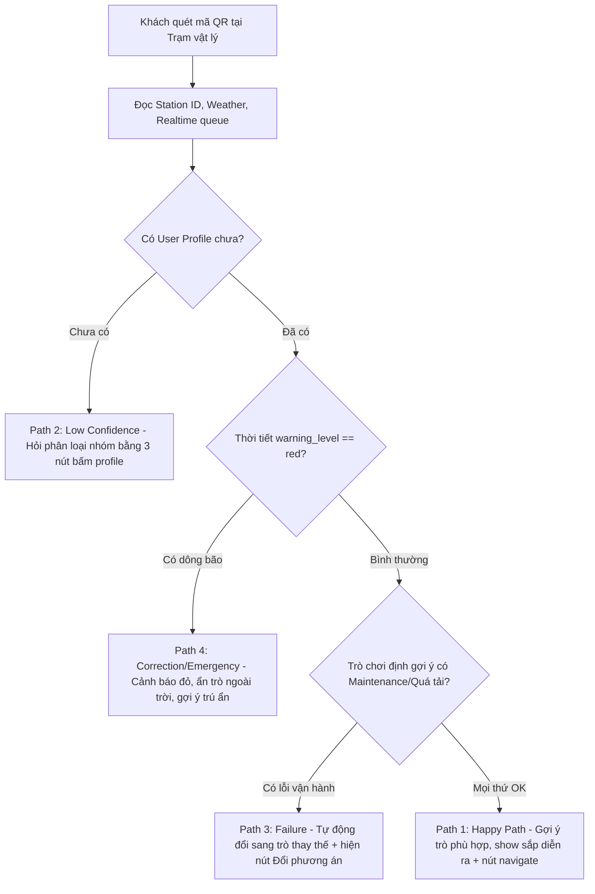

# SPEC Sản Phẩm — WonderPath AI
**Trợ lý dẫn đường ngữ cảnh (Context-Aware Micro-Itinerary / Zero-UI)**

---

## 1. Bằng chứng (Evidence)

Để xác định chính xác các điểm gãy và nỗi đau thực tế của du khách tại các công viên giải trí phức hợp (như VinWonders, Sun World...), nhóm đã thực hiện khảo sát qua trải nghiệm trực tiếp (Self-use) kết hợp phân tích các đánh giá thực tế của người dùng từ Google Play và App Store.

### 1.1. Bằng chứng Trải nghiệm Trực tiếp (Self-use Evidence)
Nhóm tự mình trải nghiệm các ứng dụng bản đồ/lập lịch trình du lịch hiện tại và ghi nhận các bất cập sau:

| Quan sát (Observation) | Ảnh chụp minh chứng | Luồng (Path) liên quan | Điều học được |
|---|---|---|---|
| Giao diện lập lịch trình trên các app du lịch bắt buộc người dùng tự thêm hoạt động, căn chỉnh giờ giấc, kéo thả sắp xếp phức tạp. Người đi chơi thường lười và ngại nghiên cứu các công cụ lập lịch rườm rà này. | [complex_planner.png](file:///c:/Users/Administrator/Day06-C401-NhomC2/spec/evidence/z7896931050103_1dc80b4a6bf0b18bbedaed3a2f196236.jpg) | **Trải nghiệm tương tác phức tạp (Cognitive Friction)** | Tránh đưa người dùng vào một trình soạn lập lịch trình. Dùng AI gợi ý lịch trình vi mô 1-2 tiếng ngay lập tức dựa trên vị trí quét QR. |
| Mô tả các trò chơi trên bản đồ và thông tin ứng dụng rất sơ sài (chỉ có tên và 1 dòng tóm tắt chung chung, không ghi rõ độ tuổi, mức độ cảm giác mạnh hay các lưu ý sức khỏe). User không đủ thông tin để quyết định đi đâu tiếp. | [attraction_info.png](file:///c:/Users/Administrator/Day06-C401-NhomC2/spec/evidence/z7896649965970_4ccc77d1338ba6abf52dff1e32a2f86a.jpg) | **Thiếu tin cậy (Low-confidence)** | AI Bot cần cung cấp thông tin trò chơi thông minh, tóm tắt nhanh độ phù hợp (ví dụ: có trẻ nhỏ, người già) ngay trong hội thoại ngắn để hỗ trợ ra quyết định. |
| Lịch trình cố định lập từ nhà bị vỡ hoàn toàn khi trò chơi chủ chốt (Tàu lượn siêu tốc) bảo trì đột xuất lúc 10:00. App không cập nhật lại lộ trình tự động, user phải tự mò mẫm đổi hướng hoặc đi lòng vòng. | [itinerary_broken.png](file:///c:/Users/Administrator/Day06-C401-NhomC2/spec/evidence/z7896929343634_04c2fb9127b5e2636fa8e4882fdab243.jpg) | **Lỗi cập nhật động (Failure / Correction)** | Bản kế hoạch tĩnh cả ngày quá dễ gãy. Lịch trình cần chia nhỏ thành các block ngắn hạn (1-2 tiếng tiếp theo) và cập nhật tức thời theo ngữ cảnh thực tế của công viên. |

### 1.2. Bằng chứng từ Đánh giá Người dùng (User Reviews & Social Evidence)

#### A. Bằng chứng phù hợp với giải pháp (Fitted Evidences)
Dưới đây là các phản hồi trực tiếp từ người dùng thực tế trên các kho ứng dụng, củng cố cho sự cần thiết của Trợ lý dẫn đường & Lộ trình vi mô:

| Phản hồi / Trích dẫn | Nguồn / Ảnh đính kèm | Đối tượng sử dụng | Nỗi đau / Lỗi trải nghiệm (Pain/Failure Mode) |
|---|---|---|---|
| *"Mấy app lập lịch trình phức tạp quá, bắt chọn điểm đi điểm đến rồi xếp giờ y như thời khóa biểu đi học. Đi chơi giải trí mà bắt đầu óc suy nghĩ nhiều thế tôi lười dùng lắm."* | Giả định đã khảo sát sơ bộ trực tuyến | Khách du lịch trẻ muốn tự do, thoải mái | **High User Friction**: Ngại thao tác các công cụ lập lịch thủ công rườm rà. |
| *"Cần bổ sung thêm mô tả cho các trò chơi. Trò nào không dành cho trẻ em, người dưới 1m4... để chủ động sắp xếp thời gian di chuyển và chọn khu vui chơi phù hợp."* | [Review - Anh Lê Nhật](file:///c:/Users/Administrator/Day06-C401-NhomC2/spec/evidence/z7896686976786_bceb439ae269d47cddd5c206e8b566ab.jpg) | Phụ huynh đi cùng con nhỏ | **Information Gap**: Thiếu thông tin cảnh báo/độ tuổi để đánh giá độ phù hợp của trò chơi với gia đình. |
| *"xem map kh ổn chút nao, định vị chậm, dùng 4g cũng kh load được, nchung quá nhiu lỗi, rất tệ nka."* | [Review - Nguyễn Tuyết Trinh](file:///c:/Users/Administrator/Day06-C401-NhomC2/spec/evidence/z7896649978521_afcd97b25c5bcb1982e209edda89d01b.jpg) | Du khách dùng mạng di động 4G | **Map & Location Failure**: Ứng dụng bản đồ quá nặng nề, không tối ưu cho mạng yếu/4G chập chờn. |
| *"Tính năng tìm đường quá tệ hại."* | [Review - Lâm Nguyễn](file:///c:/Users/Administrator/Day06-C401-NhomC2/spec/evidence/z7896686983919_2a75dd60ea730405ddecbe5b9426720d.jpg) | Du khách tự túc tìm đường | **Navigation Failure**: Chỉ đường nội khu kém chính xác, gây hoang mang khi di chuyển. |
| *"chỉ đường sai tùm lum."* | [Review - Nguyên Minh Võ](file:///c:/Users/Administrator/Day06-C401-NhomC2/spec/evidence/z7896686987000_e4466e4c5abf6a418fe6d3ab74d8af6a.jpg) | Du khách giữa các phân khu | **Navigation Failure**: Định vị xoay lệch hướng đi thực tế. |
| *"Sử dụng khó khăn. Tải lượng lớn. Đường đi hoàn toàn khác địa hình. Nhìn bản đồ leo rào không... Trải nghiệm tồi tệ."* | [Review - phuc hung Nguyen](file:///c:/Users/Administrator/Day06-C401-NhomC2/spec/evidence/z7896686979669_4adc36ca7abbb5f0104466db52230035.jpg) | Du khách đi bộ | **Physical-Digital Disconnect**: Bản đồ số không khớp với thực tế vận hành (chỉ đường đi qua rào chắn). |
| *"khách đông nhưng sảnh chờ nóng như lò, không một quạt mát, không điều hòa, ai cũng toát hết mồ hôi."* | [Review - Thanh An Nguyen](file:///c:/Users/Administrator/Day06-C401-NhomC2/spec/evidence/z7896686987000_e4466e4c5abf6a418fe6d3ab74d8af6a.jpg) | Khách chờ hàng đợi lâu | **Physical Fatigue & Queue Pain**: Kiệt sức vì chờ đợi lâu trong thời tiết nắng nóng. Cần gợi ý tránh nóng/nghỉ ngơi kịp thời. |
| *"nhập đúng mật khẩu nhưng không cách nào vào được tài khoản, vào web thì lại được... Đầu tư, chỉn chu cho app khó tới vậy?"* | [Review - An Huỳnh](file:///c:/Users/Administrator/Day06-C401-NhomC2/spec/evidence/z7896686989709_d3078a57cf3ade5e70071b75c0ff916c.jpg) | Khách muốn sử dụng app nhanh | **App Onboarding Failure**: Gặp lỗi đăng nhập khi tải ứng dụng native. Củng cố giải pháp Web App quét QR chạy ngay (Zero-Install). |
| *"toàn trò chán, đợi lâu, ko nên đi."* | [Review - Tống Mạnh](file:///c:/Users/Administrator/Day06-C401-NhomC2/spec/evidence/z7896686995420_7445fedef5dea9494936adcfe69a2f6d.jpg) | Du khách thất vọng vì xếp hàng lâu | **Queue Pain**: Thời gian xếp hàng quá dài, trải nghiệm không được tối ưu hoá gây nhàm chán. |

#### B. Bằng chứng nằm ngoài phạm vi xử lý (Unfitted Evidences)
Các bằng chứng này phản ánh lỗi vận hành vật lý hoặc hệ thống thanh toán, nhóm quyết định **bỏ qua hoặc đưa vào backlog** vì không thuộc phạm vi xử lý của Trợ lý dẫn đường ngữ cảnh:

| Trích dẫn phản hồi | Nguồn | Đối tượng sử dụng | Lý do không khớp (Unfitted) |
|---|---|---|---|
| *"mua vé luôn hiện lỗi, gọi cho tổng đài thì bị tắt máy ngang."* | [phúc nguyễn](file:///c:/Users/Administrator/Day06-C401-NhomC2/spec/evidence/z7896686995420_7445fedef5dea9494936adcfe69a2f6d.jpg) | Khách mua vé online | **Lỗi cổng thanh toán**: Nằm ngoài phạm vi tối ưu hóa lộ trình di chuyển. |
| *"mua vé mà đi xe bus không được, dẹp luôn đi."* | [Vũ Cường](file:///c:/Users/Administrator/Day06-C401-NhomC2/spec/evidence/z7896686995420_7445fedef5dea9494936adcfe69a2f6d.jpg) | Khách đi xe bus trung chuyển | **Lỗi dịch vụ vận chuyển ngoại khu**: Nằm ngoài phạm vi điều phối nội khu công viên. |
| *"app buộc cập nhật nhưng không có bản cập nhật nào, nên không xài đc gỡ bỏ rồi cài lại cũng vậy..."* | [Vo DUY HUNG](file:///c:/Users/Administrator/Day06-C401-NhomC2/spec/evidence/z7896686987000_e4466e4c5abf6a418fe6d3ab74d8af6a.jpg) | Khách tải native app | **Lỗi kỹ thuật phân phối của Store**: WonderPath là Web App quét QR không cài đặt nên không bị ảnh hưởng. |

### 1.3. Bằng chứng từ Đối thủ / Mô hình Tương tự (Competitor & Analog Evidence)

- **Disney Genie+ (My Disney Experience App)**:
  - *Cách xử lý*: Cho phép người dùng chọn sở thích cá nhân, sau đó đề xuất trò chơi tiếp theo dựa trên thời gian chờ xếp hàng thời gian thực (Wait Times) và vị trí của khách hàng.
  - *Pattern học được*: Định tuyến động và tối ưu hóa hàng đợi thời gian thực.
  - *Áp dụng trong dự án*: Rút gọn scope. Thay vì thiết kế app nặng nề phức tạp, WonderPath đưa ra các gợi ý siêu ngắn gọn thông qua hội thoại (Conversational UI) kích hoạt bằng QR.
- **Zalo Mini App / WeChat Mini Program**:
  - *Cách xử lý*: Khách hàng quét mã QR tại các bàn ăn vật lý để nhận diện số bàn và gọi món ngay lập tức mà không cần tải ứng dụng hay đăng nhập tài khoản.
  - *Pattern học được*: Tích hợp điểm chạm vật lý (Physical Touchpoint Integration) & Không cần cài đặt (Zero-Install).
  - *Áp dụng trong dự án*: Đặt mã QR tại các bảng chỉ đường của từng phân khu. Khách quét mã để truyền tự động vị trí (Station ID) và thời gian thực vào chatbot, kích hoạt câu chào AI thông minh thay vì phải điền form tìm kiếm thủ công.

### 1.4. Chuyển dịch từ Bằng chứng sang Ý tưởng (Evidence -> Insight -> Opportunity)

> [!NOTE]
> **Ý kiến đúc kết (Insight)**: Du khách khi đi chơi muốn thư giãn tuyệt đối, họ cực kỳ lười tự tay nghiên cứu các công cụ lập kế hoạch phức tạp hoặc tự đọc mô tả trò chơi sơ sài. Đồng thời, mọi kế hoạch lên sẵn cho cả ngày (static plan) rất dễ bị phá vỡ bởi các yếu tố thực tế (thời tiết thay đổi đột ngột, trò chơi bảo trì, hàng đợi quá tải). Họ cần một trợ lý hỗ trợ ra quyết định tức thời, cực kỳ tối giản (Zero-UI/Zero-Input) để có ngay gợi ý lịch trình ngắn hạn (1-2 tiếng) tối ưu phù hợp với vị trí và nhóm đi cùng.

> [!TIP]
> **Cơ hội sản phẩm (Opportunity)**: Sử dụng AI (Gemini API) kết hợp quét mã QR vật lý tại chỗ để tự động nhận dạng vị trí và thời gian (Zero-Input). AI sẽ phản hồi bằng một hội thoại siêu ngắn (Conversational UI) cung cấp thông tin trò chơi được cá nhân hoá và gợi ý lịch trình ngắn hạn 1-2 tiếng tối ưu kèm các nút bấm phản hồi nhanh, giúp giảm tối đa ma sát tương tác của người dùng.

### 1.5. Sự thay đổi của SPEC sau khi có Bằng chứng

- **Trước khi có Bằng chứng**: Nhóm dự định xây dựng một ứng dụng di động cài đặt (Native App) đầy đủ tính năng, yêu cầu người dùng điền khảo sát sở thích cá nhân sâu để thiết kế lộ trình cố định chi tiết từ sáng đến tối trước khi đi.
- **Sau khi có Bằng chứng**: Nhóm đổi sang xây dựng một Web App siêu nhẹ (Zero-Install). Khi quét mã QR tại trạm vật lý, hệ thống tự động nắm giữ vị trí & thời gian hiện tại, AI tiếp đón bằng một cuộc hội thoại siêu ngắn chào đón và đề xuất các lựa chọn phản hồi nhanh bằng nút bấm để sinh lịch trình ngắn hạn trong 1-2 tiếng tiếp theo.
- **Lý do thay đổi**: Khách hàng đi chơi muốn thư giãn tuyệt đối, cực kỳ lười tự nghiên cứu công cụ lập lịch. Việc gợi ý ngay lịch trình 1-2 tiếng thông qua hội thoại quét QR giúp tối thiểu hóa ma sát tương tác và phản ứng linh hoạt trước biến động vận hành thực tế của công viên.

---

## 2. Lát cắt để build (Build Slice)

> [!IMPORTANT]
> **Lát cắt Prototype (Build Slice)**:
> Cho du khách tại công viên phức hợp đang muốn tìm địa điểm vui chơi tiếp theo trong 1-2 tiếng tới, prototype sẽ dùng AI (Gemini API) để phân tích ngữ cảnh (vị trí quét QR, thời gian hiện tại, thời tiết, tình trạng hàng đợi thực tế) và tạo ra một lịch trình vi mô ngắn gọn (Micro-Itinerary), tạo ra cuộc trò chuyện siêu ngắn (Conversational UI) chào đón và đề xuất 2-3 lựa chọn phản hồi nhanh bằng nút bấm để sinh lịch trình ngắn hạn trong 1-2 tiếng tiếp theo, và xử lý failure mode (AI gợi ý trò chơi đang bảo trì/hàng đợi quá tải hoặc trời mưa trò chơi ngoài trời dừng hoạt động) bằng việc tự động truy xuất API trạng thái công viên thời gian thực để cập nhật phương án thay thế ngay trong chatbox và hiển thị nút `[Đổi phương án khác]`.

---

## 3. AI Product Canvas

| Ô Canvas | Câu hỏi & Lời giải cho WonderPath AI |
|---|---|
| **Value (Giá trị)** | **Đối tượng**: Du khách tham quan công viên phức hợp (phụ huynh dắt trẻ nhỏ/người già, nhóm bạn trẻ).<br>**Nỗi đau**: Di chuyển lòng vòng mệt mỏi dưới nắng nóng, xếp hàng vô ích vì không biết trò chơi đang bảo trì/quá tải hoặc thiếu thông tin phù hợp.<br>**AI Giải quyết**: Đưa ra lịch trình vi mô (1-2 tiếng) tức thời, cá nhân hóa dựa trên thời tiết, hàng đợi, vị trí quét QR mà cách lập lịch thủ công truyền thống không thể tự động hóa linh hoạt được. |
| **Trust (Niềm tin)** | **Khi AI trả lời sai** (Ví dụ gợi ý trò chơi ngoài trời lúc trời mưa dông hoặc trò chơi vừa bảo trì mà hệ thống chưa cập nhật kịp):<br>- Người dùng dễ dàng nhận thấy qua biển báo thực tế.<br>- Khắc phục trên UI: Luôn hiển thị nút `[Đổi phương án khác]` để người dùng yêu cầu AI tái định tuyến ngay lập tức.<br>- Cập nhật trạng thái khẩn cấp: AI hiển thị cảnh báo đỏ trên thẻ hội thoại và chủ động chuyển hướng sang các trò chơi trong nhà mát mẻ (KidZone) hoặc chòi trú ẩn gần nhất kèm nút `[🚨 Chỉ đường trú mưa]`. |
| **Feasibility (Tính khả thi)** | **Chi phí**: Gọi Gemini API dạng Structured JSON đầu ra ngắn gọn (dưới 100 tokens phản hồi), chi phí vận hành cực thấp.<br>**Độ trễ (Latency)**: Kiểm soát dưới 1.5 - 2 giây để đảm bảo trải nghiệm chat mượt mà trên thiết bị di động.<br>**Dữ liệu đầu vào**: Danh sách trò chơi, danh sách trạm quét QR, file trạng thái vận hành thời gian thực (được giả lập tĩnh/API).<br>**Rủi ro lớn nhất**: Gemini trả về sai cấu trúc JSON hoặc bị mất kết nối API.<br>**Ngưỡng dừng**: Nếu API lỗi liên tục, hệ thống fallback về giao diện gợi ý tĩnh cố định dựa theo Station ID hiện tại. |
| **Tín hiệu học (Learning Signals)** | Khi người dùng tương tác bấm các nút phản hồi (Ví dụ: `[Gia đình có trẻ nhỏ 👨‍👩‍👧‍👦]`, `[Đổi phương án khác]`), thông tin này được lưu lại trong session profile của phiên quét QR hiện tại. Hệ thống sẽ tích hợp dữ liệu này để làm tập test-cases (evaluation scenarios) và tinh chỉnh prompt giúp gợi ý cá nhân hóa hơn cho các trạm quét tiếp theo trong ngày. |

---

## 4. Tăng năng lực hay tự động hóa (Augment/Automate Decision)

Nhóm quyết định chọn mô hình **Tăng năng lực (Augmentation)** thay vì Tự động hóa hoàn toàn.

- **Mức độ chọn**:
  - [x] **Augmentation**: AI gợi ý/tạo bản nháp/phân loại, người dùng là người quyết định cuối cùng.
  - [ ] **Conditional Automation**: AI tự làm trong một số case hẹp; case rủi ro chuyển giao cho con người.
  - [ ] **Automation**: AI tự quyết định và tự hành động hoàn toàn.

- **Lý do chọn**: Vui chơi giải trí là trải nghiệm mang tính tận hưởng cá nhân cao. Việc ép buộc người dùng đi theo lộ trình cố định do AI tự động quyết định (Automation) sẽ làm mất đi cảm giác tự do, khám phá của du khách. AI đóng vai trò làm trợ lý gợi ý (Augmentation) để lọc thông tin nhiễu, giúp người dùng giảm thiểu gánh nặng lựa chọn thông qua các nút bấm tương tác đơn giản.

- **Vai trò của con người trong hệ thống**:
  - **Decider (Người quyết định)**: Người dùng chủ động lựa chọn các nút gợi ý (`navigate` tới trò chơi) theo ý muốn của mình.
  - **Rescuer (Người cứu hộ)**: Bấm nút `[Đổi phương án khác]` hoặc tự do di chuyển ngoài lộ trình gợi ý khi thực tế tại chỗ có thay đổi đột ngột.

---

## 5. Bốn đường đi của trải nghiệm (Four Paths)

Hệ thống được thiết kế để xử lý linh hoạt 4 kịch bản tương tác người dùng:



### Chi tiết các đường đi của trải nghiệm:

| Đường đi (Path) | Tình huống kích hoạt | Giao diện hiển thị và xử lý của Prototype | Hành động nút bấm tương ứng |
|---|---|---|---|
| **Happy Path (Đường thuận)** | Khách là gia đình có bé nhỏ quét QR tại **Trạm 1 (Cổng Khu Cổ Tích)** lúc 10:00 sáng. Mọi trò chơi hoạt động bình thường, thời tiết nắng ấm (31°C). | Đưa ra câu chào thân thiện chào mừng gia đình. Gợi ý 2 hoạt động tối ưu: Xem **Show Rồng Lửa** (sắp diễn ra lúc 10:15, cách 350m) và chơi **Lâu Đài Huyền Bí** (trò chơi trong nhà mát mẻ, chờ 15 phút, phù hợp bé dưới 1m). | - `[Xem Show Rồng Lửa (10:15)]` (navigate)<br>- `[Chơi Lâu Đài Huyền Bí]` (navigate)<br>- `[Tìm nhà hàng ăn trưa gần đây]` (suggest_dining) |
| **Low-confidence Path (Khi AI chưa chắc chắn)** | Khách quét QR tại trạm nhưng hệ thống chưa có thông tin phân loại nhóm du khách (user_profile: null). | AI không tự tiện gợi ý lịch trình chi tiết. Chatbot sẽ chào và hỏi nhanh đối tượng đi cùng để cập nhật profile tạm thời cho phiên quét. | - `[Gia đình có trẻ nhỏ 👨‍👩‍👧‍👦]` (update_profile)<br>- `[Nhóm bạn trẻ thích cảm giác mạnh 🎢]` (update_profile)<br>- `[Đi thong thả nghỉ dưỡng 🍃]` (update_profile) |
| **Failure Path (Khi có lỗi vận hành thực tế)** | Nhóm bạn trẻ quét QR tại **Trạm 2 (Ngã Tư Phiêu Lưu)** muốn chơi Tàu lượn siêu tốc nhưng trò này đột ngột bảo trì kỹ thuật (maintenance). | AI tự động phát hiện trạng thái bảo trì trong `realtime_status`. Chủ động thay thế bằng gợi ý trò **Đu Quay Dây Văng** (cách 600m, chờ 10 phút, cảm giác mạnh vừa) hoặc ăn uống nạp năng lượng tại **Khu Ẩm Thực Nhanh Express** ngay cạnh. | - `[Chỉ đường tới Đu Quay Dây Văng]` (navigate)<br>- `[Ghé Khu Ẩm Thực Nhanh Express]` (navigate)<br>- `[Đổi phương án khác]` (request_alternative) |
| **Correction Path (Khi người dùng sửa hoặc biến động thời tiết)** | Khách quét QR tại **Trạm 3 (Bến Thuyền Hồ Trung Tâm)** lúc 15:00, thời tiết đột ngột đổ dông bão cảnh báo đỏ (warning_level: red). | AI lập tức kích hoạt chế độ khẩn cấp: Ẩn toàn bộ trò chơi ngoài trời, hiển thị cảnh báo đỏ và chỉ dẫn nhanh tới nơi trú mưa an toàn gần nhất: **Khu Vui Chơi Trong Nhà KidZone** (cách 250m) hoặc **Chòi Nghỉ Mát Ven Hồ** (cách 30m). | - `[🚨 Chỉ đường trú mưa KidZone]` (navigate)<br>- `[Chỉ đường tới Chòi Nghỉ Ven Hồ]` (navigate) |

---

## 6. Những kiểu lỗi đáng lo nhất (Critical Failure Modes)

Nhóm xác định và thiết kế giải pháp xử lý cho 3 kiểu lỗi nguy hiểm nhất:

### 6.1. Lỗi thời tiết dông sét cực đoan (Cực kỳ nguy hiểm)
- *Xuất hiện khi*: Thời tiết thay đổi đột ngột từ nắng sang dông bão, sấm sét lúc du khách đang quét QR tại các trạm ngoài trời.
- *Hậu quả*: AI tiếp tục gợi ý các trò chơi ngoài trời hoặc show diễn đã bị hủy, dẫn tới khách bị ướt, mệt mỏi, hoặc nguy hiểm hơn là gặp tai nạn do sét đánh/trơn trượt.
- *Cách xử lý*: Tích hợp chặt chẽ chỉ số `weather.warning_level` trong prompt. Nếu warning_level là "red", hệ thống ép buộc AI ẩn toàn bộ trò chơi ngoài trời và chuyển sang chế độ khẩn cấp: Hiển thị biểu tượng cảnh báo `⚠️ CẢNH BÁO THỜI TIẾT XẤU` và chỉ đường di chuyển nhanh tới khu vực trú ẩn trong nhà gần nhất.

### 6.2. Lỗi gợi ý trò chơi đang bảo trì hoặc quá tải
- *Xuất hiện khi*: Trò chơi gặp sự cố kỹ thuật đột xuất hoặc hàng xếp quá dài (> 45 phút) nhưng AI vẫn gợi ý cho du khách đi bộ tới đó.
- *Hậu quả*: Du khách mất thời gian di chuyển đi bộ xa (500m - 600m) dưới trời nắng chỉ để nhận lại biển báo tạm dừng hoạt động hoặc thời gian xếp hàng quá lâu, gây ức chế cao độ.
- *Cách xử lý*: Quy định quy tắc lọc nghiêm ngặt trong System Prompt. AI phải đối chiếu ID trò chơi với `realtime_status`. Nếu trạng thái là "maintenance" hoặc wait_time_mins > 45 phút, loại bỏ ngay khỏi danh sách đề xuất và tìm phương án thay thế có hàng đợi dưới 20 phút.

### 6.3. Lỗi cấu trúc phản hồi của AI (AI Output Malfunction)
- *Xuất hiện khi*: Gemini API trả về văn bản tự do thay vì JSON hoặc trả về thiếu các trường bắt buộc gây lỗi crash giao diện Frontend.
- *Hậu quả*: Người dùng nhìn thấy màn hình trắng hoặc lỗi code, làm gián đoạn hoàn toàn trải nghiệm di chuyển tại công viên.
- *Cách xử lý*: Sử dụng cấu hình `response_schema` (Structured Outputs) của SDK Gemini để đảm bảo định dạng trả về luôn tuân thủ cấu trúc Pydantic `WonderPathResponse`. Frontend thiết kế thêm cơ chế fallback: Nếu API bị timeout hoặc lỗi parse JSON, tự động render 3 nút bấm tĩnh dẫn đường mặc định dựa trên trạm QR hiện tại mà không gọi AI.

---

## 7. Kế hoạch kiểm thử và bằng chứng demo

Hệ thống đã xây dựng sẵn một bộ khung kiểm thử tự động (Evaluation Framework) để đánh giá chất lượng prompt và độ ổn định của các kịch bản tương tác.

### 7.1. File mã nguồn kiểm thử
Hệ thống sử dụng file mã nguồn [codebase/run_eval.py](file:///c:/Users/Administrator/Day06-C401-NhomC2/codebase/run_eval.py) làm trung tâm để tự động hóa việc render prompt và gọi Gemini API để kiểm chứng các kịch bản.

### 7.2. Bộ Mock Data đầu vào
Hệ thống truy xuất dữ liệu từ các file mock data tĩnh trong thư mục `codebase/mock-data/`:
- [attractions.json](file:///c:/Users/Administrator/Day06-C401-NhomC2/codebase/mock-data/attractions.json): Chứa thông tin 10 địa điểm/trò chơi trong công viên với các thông số phân loại (indoor/outdoor, thrill_level, constraints...).
- [stations.json](file:///c:/Users/Administrator/Day06-C401-NhomC2/codebase/mock-data/stations.json): Bản đồ toạ độ và danh sách trò chơi lân cận của 4 trạm quét QR.
- [realtime_status.json](file:///c:/Users/Administrator/Day06-C401-NhomC2/codebase/mock-data/realtime_status.json): Trạng thái hàng đợi và vận hành thời gian thực.
- [weather.json](file:///c:/Users/Administrator/Day06-C401-NhomC2/codebase/mock-data/weather.json): Chỉ số thời tiết hiện tại.

### 7.3. Kịch bản kiểm thử (Test Scenarios)
Tệp [test_scenarios.json](file:///c:/Users/Administrator/Day06-C401-NhomC2/codebase/mock-data/test_scenarios.json) định nghĩa 4 test case cụ thể ứng với 4 đường đi của trải nghiệm:
1. `scenario_01_happy_path`: Kiểm thử gợi ý tối ưu cho gia đình có bé nhỏ tại Khu Cổ Tích lúc 10:00 sáng.
2. `scenario_02_low_confidence`: Kiểm thử khả năng hỏi lại phân loại nhóm du khách khi quét QR thiếu profile.
3. `scenario_03_failure_maintenance`: Kiểm thử tự động chuyển hướng thay thế khi trò chơi Tàu lượn siêu tốc bảo trì.
4. `scenario_04_weather_emergency`: Kiểm thử cảnh báo khẩn cấp đỏ và chỉ đường trú ẩn khi trời đổ dông stormy.

### 7.4. Hướng dẫn chạy Đánh giá (Verification Commands)
Để chạy kiểm tra, bạn cần di chuyển vào thư mục `codebase` hoặc truyền đúng đường dẫn tới các tệp mock data.

**Cách 1: Di chuyển vào thư mục `codebase` (Khuyên dùng)**
```bash
cd codebase
# Chạy dry-run kiểm tra cấu trúc prompt (không gọi API)
python run_eval.py --dry-run

# Chạy đánh giá thực tế gọi Gemini API (Yêu cầu có GEMINI_API_KEY trong file .env)
python run_eval.py --model gemini-1.5-flash
```

**Cách 2: Chạy từ thư mục gốc của dự án**
```bash
# Chạy dry-run kiểm tra cấu trúc prompt từ thư mục gốc
python codebase/run_eval.py --dry-run --scenarios codebase/mock-data/test_scenarios.json --mock-data-dir codebase/mock-data

# Chạy đánh giá thực tế gọi Gemini API từ thư mục gốc
python codebase/run_eval.py --model gemini-1.5-flash --scenarios codebase/mock-data/test_scenarios.json --mock-data-dir codebase/mock-data
```
*Kết quả đánh giá chi tiết sẽ được tự động kết xuất thành file JSON report trong thư mục `codebase/runs/eval_run_YYYYMMDD_HHMMSS.json` để làm bằng chứng tích hợp.*

---

## 8. Phân công nhiệm vụ (Assignment)

Mỗi thành viên trong nhóm C2 được phân bổ các vai trò rõ ràng để sẵn sàng xây dựng prototype trong Day 06:

| Thành viên | Nhiệm vụ đảm nhiệm | Bằng chứng đầu ra trong Repo |
|---|---|---|
| **Nguyễn Huy Bảo**<br>(2A202600997) | **Kịch bản & Dữ liệu giả lập**: Quản lý và cập nhật cấu trúc dữ liệu mock-data, xây dựng các kịch bản dữ liệu hàng đợi và thời tiết khó để kiểm thử hệ thống. | Các file JSON mock-data hoàn chỉnh trong thư mục [mock-data](file:///c:/Users/Administrator/Day06-C401-NhomC2/codebase/mock-data). |
| **Nguyễn Văn Đoan**<br>(2A202600795) | **Lập trình Giao diện di động**: Thiết kế giao diện Web App/Zalo Mini App hiển thị thẻ hội thoại ngắn (Chat Card UI) kèm danh sách nút bấm hành động linh hoạt, xử lý nút [Undo/Quay lại] và [Đổi phương án khác]. | Mã nguồn Frontend trong thư mục `codebase/frontend` (hoặc link deploy). |
| **Lê Duy Hùng**<br>(2A202600718) | **Prompt Engineering & AI Logic**: Thiết lập System Prompt, tinh chỉnh tham số Gemini API, viết logic đóng gói Context đầu vào và kiểm soát cấu trúc JSON đầu ra thông qua Response Schema. | Mã nguồn cấu hình Prompt và Schema định nghĩa trong file tích hợp. |
| **Trần Hoàng Đạt** <br>(2A202600807) | **Prompt testting & AI performance monitoring**: Kiểm thử prompt, tinh chỉnh tham số Gemini API, viết logic tính token, chỉ số thời gian,...| Mã nguồn cấu hình kiểm thử test senarios, tính token và lưu kết quả log. |
| **Phạm Ngọc Vinh**<br>(2A202600563) | **Backend & Tích hợp API**: Xây dựng máy chủ API trung gian kết nối giữa ứng dụng di động, cơ sở dữ liệu mock-data thời gian thực và Gemini API. | Mã nguồn Backend API Server trong thư mục `codebase/backend`. |
| **Tạ Duy Xuân**<br>(2A202600970) | **Đảm bảo chất lượng & Demo**: Quay video demo sản phẩm dài 3 phút, soạn kịch bản thuyết trình bảo vệ các quyết định sản phẩm trước lớp. | File slide thuyết trình, video demo và tệp báo cáo chạy đánh giá trong thư mục `codebase/runs`. |
